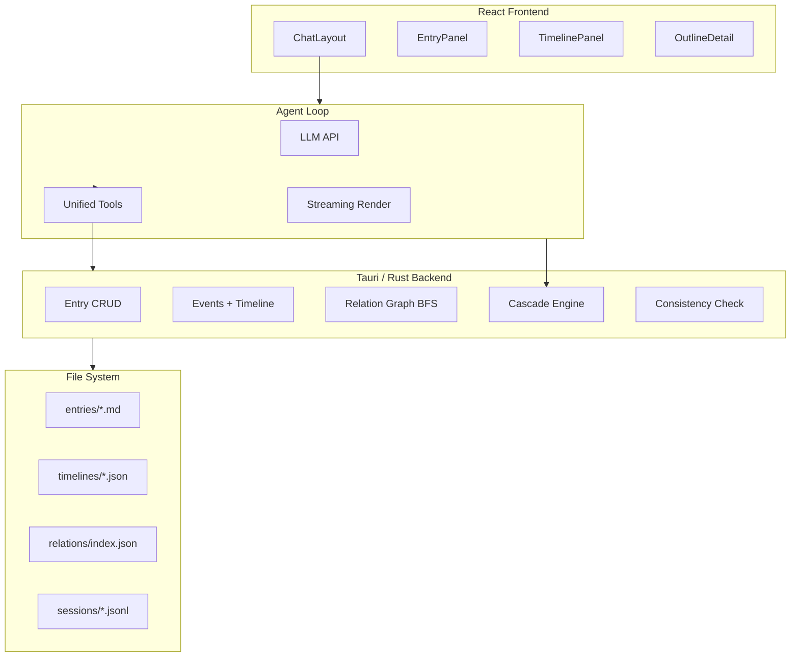

<p align="center">
  
</p>

<p align="center">
  <strong>AI Worldbuilding Workstation on Your Desktop</strong><br/>
  Structured world entries · AI-powered writing · Timeline visualization · Offline-first
</p>

<p align="center">
  
  
  
  
  
</p>

---

## What It Does

**WorldForge** is a desktop app for fiction writers and worldbuilders. It gives you a structured knowledge base for your fictional world, plus an AI agent that reads, writes, and reasons about your setting — so you can write stories with consistent, well-researched context.

- **7 Entry Types** — Characters, Locations, Organizations, Systems, Artifacts, Eras, Concepts. Markdown files with YAML frontmatter, linked via a unified relation graph.
- **Timeline + Events** — Place events on a timeline, link them to entries and chapters. Entry relation changes attach to events for full causality tracking.
- **AI Agent with Tools** — Closed-loop toolchain: auto-searches relevant entries before writing, checks constraint violations after editing, traverses relation graphs for context.
- **Outline + Chat** — Outline chapters linked to timeline events. All conversations (including tool calls) persist as JSONL.
- **Local & Offline** — Files as your database. No cloud dependency. Compatible with Obsidian.

---

## Quick Start

### Download (Windows + macOS)

Download the latest `.dmg` and `.msi` from [Releases](https://github.com/fange12306/worldforge/releases). Currently supports macOS (Apple Silicon) and Windows.

### Build from Source

```bash
git clone https://github.com/fange12306/worldforge.git
cd worldforge
npm install
npm run tauri dev
```

After launch, configure your LLM API key in Settings (Anthropic / OpenAI / DeepSeek, plus custom API base URLs for proxies or self-hosted models).

---

## Architecture



---

## Data Storage

No database. All data lives as human-readable files, interoperable with Obsidian.

```
<world>/
├── world.json              World metadata
├── entries/                Entries (.md + YAML frontmatter)
│   ├── characters/         Characters
│   ├── locations/          Locations
│   ├── organizations/      Organizations
│   ├── systems/            Systems
│   ├── artifacts/          Artifacts
│   ├── eras/               Eras
│   └── concepts/           Concepts
├── timelines/              Timelines + Events
│   ├── index.json          Timeline list
│   └── <id>/events.json    Event data
├── relations/index.json    Unified relation graph
├── outline/<storyId>/      Outline chapters (.md)
├── stories/<id>.json       Story metadata
├── sessions/<id>.jsonl     Chat history
├── memory/                 World memory (.md)
└── uploads/<convId>/       Uploaded files
```

---

## Tech Stack

| Layer | Technology |
|-------|------------|
| Desktop Shell | Tauri v2 (Rust) |
| Frontend | React 18 + TypeScript + Tailwind CSS |
| Components | Radix UI + Lucide Icons |
| State | Zustand |
| Graph | BFS adjacency list (Rust) |
| LLM | Anthropic / OpenAI / DeepSeek |
| Storage | File system (.md / .json / .jsonl) |

---

## Roadmap

Here's what we're building next:

### 1. Entry State Timeline
A personal history tracker for each entry. Every character, organization, or artifact changes over time — a captain becomes a colonel, a city falls into ruin, an artifact gains new power. State tracking lets you record these changes along the timeline, so you can see *who was what, when*.

### 2. Character Personality Profiles
What makes your characters tick? Define personality traits, speech patterns, motivations, and flaws for each character. The AI uses these profiles to keep characters in-character — decisive characters act fast, cynical ones talk sharp, the gentle giant never suddenly picks a fight.

### 3. Smart Chapter Writing
Write chapter bodies with an AI that actually knows your world. It pulls in the relevant characters (with their personalities), the scene's timeline context, and your preferred writing style — then writes prose that stays consistent with previous chapters. Want Hemingway prose today and wuxia tomorrow? Style templates make it a one-click switch.

---

## Further Reading

- [Design Doc](DESIGN.md) — Architecture decisions, phase planning, data persistence
- [Timeline Design](TIMELINE_DESIGN.md) — Time format, event model, cascade engine, UI design

---

## License

MIT © WorldForge

---

<p align="center">
  <sub>WorldForge 是一个 AI 辅助的世界构建桌面应用 — 为虚构创作提供结构化知识库、时间线和智能写作工具。详见 <a href="DESIGN.md">设计文档</a>。</sub>
</p>
