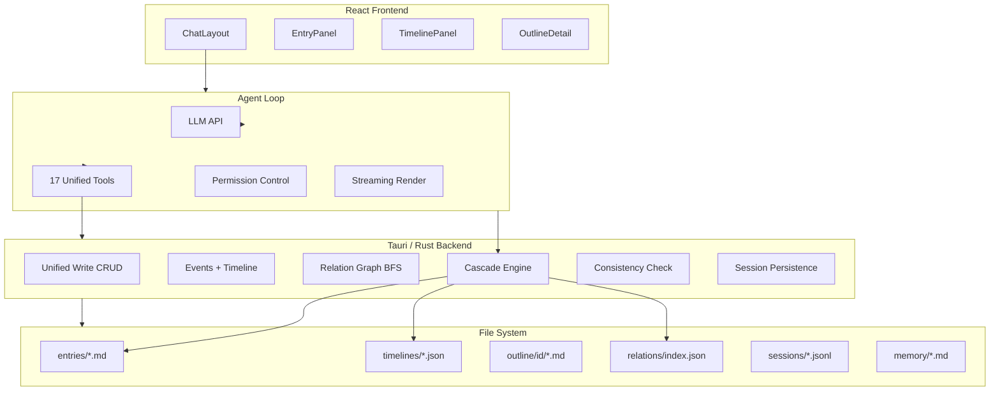
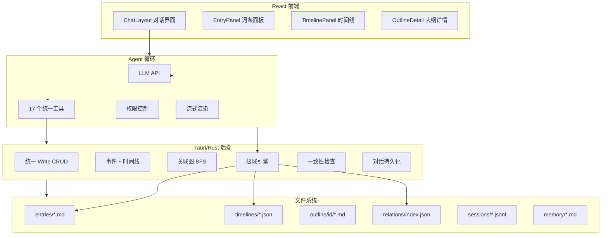

<p align="center">
  <picture>
    <source media="(prefers-color-scheme: dark)" srcset="https://img.shields.io/badge/WorldForge-amber?style=for-the-badge&logo=data:image/svg+xml;base64,PHN2ZyB4bWxucz0iaHR0cDovL3d3dy53My5vcmcvMjAwMC9zdmciIHdpZHRoPSIyNCIgaGVpZ2h0PSIyNCIgdmlld0JveD0iMCAwIDI0IDI0IiBmaWxsPSJub25lIiBzdHJva2U9IiNmZmYiIHN0cm9rZS13aWR0aD0iMiI+PHBhdGggZD0iTTEyIDJhMTAgMTAgMCAxIDAgMCAyMCAxMCAxMCAwIDEgMCAwLTIwWiIvPjxwYXRoIGQ9Ik0xMiA2djZsNCAyIi8+PC9zdmc+" />
    
  </picture>
</p>

<p align="center">
  <strong>AI Worldbuilding Workstation on Your Desktop</strong><br/>
  Manage fictional world entries · Write consistent stories · Visualize timelines<br/>
  Files as your database, AI Agent as your co-writer
</p>

<p align="center">
  
  
  
  
  
  
</p>

<p align="center">
  <a href="#english"><strong>English</strong></a> &nbsp;·&nbsp;
  <a href="#chinese"><strong>中文</strong></a>
</p>

---

<a name="english"></a>

## 💡 Philosophy

> **The setting is deterministic. Stories are subset projections.**
>
> Build the world first — its physics, history, characters — then tell stories within it.
> Every creative act is a query against the "world database," and the AI Agent ensures projections never violate setting constraints.

**What makes WorldForge different:**

| Approach | Structured DB | Agent Read/Write | Timeline Engine | Offline |
|----------|:-----------:|:------------:|:--------:|:------:|
| ChatGPT / Claude chat | ❌ Plain text memory | ❌ Prompt-based guess | ❌ | ❌ |
| World Anvil / Campfire | ✅ | ❌ No AI Agent | ❌ Manual | ✅ |
| Sudowrite | ❌ No structured world | ✅ But hallucinates | ❌ | ❌ |
| Obsidian + Claude | ✅ Manual upkeep | ❌ Two tools stitched | ❌ | ✅ |
| **WorldForge** | ✅ **Files as DB** | ✅ **Closed-loop tools** | ✅ **Event bridging** | ✅ **Local Tauri** |

---

## 🎯 What It Does

<p align="center">
  <em>A complete world → the AI Agent understands it → write any story in your universe</em>
</p>

### Entry System — Your World Database

7 types of structured entries (Character, Location, Organization, System, Artifact, Era, Concept), stored as Markdown files with YAML frontmatter. Entries can be linked with relations and constraint rules.

```
🔮 Zhao Yuanhang — Captain of Dawn, bionic prosthesis, PTSD from quantum jumps
  ├── Related: Alyssa Chen (Chief Scientist), Dawn (commands), Dark Matter Anomaly (wary of)
  └── Constraint: Any jump he oversees must complete a 72-hour charge cycle
```

### Timeline + Events — The Narrative Bridge

Events on the timeline connect entries to outline chapters. An event sits at a time point, linked to multiple entries and chapters. Entry relation changes (add/remove/modify) are attached to events.

```
3rd Era
  └─ Year 327
       └─ March
            └─ 15th  [Dawn Launches] —— 🏷 Zhao Yuanhang · Alyssa Chen · Dawn · Outpost 7
            └─ 15th  [Captain's Oath] —— 🏷 Zhao Yuanhang · Dawn
                                            + Zhao Yuanhang ↔ Hollow Survivor: survivor
  └─ Year 328
       └─ July ——— [Dark Matter Anomaly Encountered]
       └─ Aug  ——— [Quantum Comm Lost]
  └─ Year 330
       └─ Feb  ——— [New Earth Discovered]
       └─ June ——— [First Contact Signal]
```

### AI Agent — A Writer That Understands Your World

The Agent has a full toolchain (read/write entries, create events, traverse relation graphs, check consistency). It auto-searches relevant settings before writing, and auto-checks constraint conflicts after editing.

> "Write a chapter about Dawn's encounter with the dark matter zone" → Agent auto-queries entries → reads relations → traverses graph → checks constraints → writes → consistency check → output

### Outline + Chat — Linear Creation

Outline chapters link to timeline events, Agent assists creation. All conversations (Thinking + Tool Calls) persist as JSONL, surviving restarts.

---

## ⚡ Quick Start

```bash
git clone https://github.com/fange12306/worldforge.git
cd worldforge
npm install
npm run tauri dev
```

After launch, configure your LLM API key in Settings (supports Anthropic / OpenAI / DeepSeek), create a world, and start chatting.

---

## 🏗 Architecture



---

## 📁 Data Storage

No database. All data lives as human-readable files on your machine, interoperable with Obsidian.

```
<world>/
├── world.json                World metadata
├── entries/                  Entries (.md + YAML frontmatter)
│   ├── characters/           Characters
│   ├── locations/            Locations
│   ├── organizations/        Organizations
│   ├── systems/              Systems
│   ├── artifacts/            Artifacts
│   ├── eras/                 Eras
│   └── concepts/             Concepts
├── timelines/                Timelines + Events
│   ├── index.json            Timeline list
│   └── <id>/events.json      Event data
├── relations/index.json      Unified relation graph
├── outline/<storyId>/        Outline chapters (.md)
├── stories/<id>.json         Story metadata
├── sessions/<id>.jsonl       Chat history
├── memory/                   World memory (.md)
└── uploads/<convId>/         Uploaded files
```

---

## 🗺 Roadmap

| Phase | Scope | Status |
|-------|-------|:------:|
| 0 | Skeleton — Tauri + React + Tailwind + Chat UI | ✅ |
| 1 | Knowledge Core — Entry CRUD + Persistence + File Watch | ✅ |
| 2 | Agent Breathing — LLM API + Agent Loop + Permissions | ✅ |
| 3 | Creation UX — Outline + Command Palette + Search | ✅ |
| 4 | Entity Relations — Unified Graph + BFS Traversal + Consistency Engine | ✅ |
| 5 | Timeline — Event System + Cascade Engine + Timeline Panel | ✅ |
| 6 | Polish & Ship — Context Compaction + Export + Packaging | ⬜ Future |

---

## 🔧 Tech Stack

| Layer | Technology |
|-------|------------|
| Desktop Shell | Tauri v2 (Rust) |
| Frontend | React 18 + TypeScript + Tailwind CSS |
| Component Library | Radix UI + Lucide Icons |
| State Management | Zustand |
| Graph Algorithms | BFS adjacency list (Rust) |
| LLM | Anthropic / OpenAI / DeepSeek |
| Storage | File system (.md / .json / .jsonl) |

---

## 📖 Further Reading

- [Full Design Doc](DESIGN.md) — Architecture decisions, phase planning, data persistence
- [Timeline Design](TIMELINE_DESIGN.md) — Time format, event model, cascade engine, UI design

---

## 📄 License

MIT © WorldForge

<p align="center">
  <a href="#worldforge">↑ Back to top</a> &nbsp;·&nbsp;
  <a href="#chinese">中文版 ▼</a>
</p>

---

<a name="chinese"></a>

## 💡 核心哲学

> **设定是确定性的，故事是子集投影。**
>
> 先建好世界——它的物理法则、历史事件、人物关系——然后在里面讲各种故事。
> 每一次创作都是对"世界数据库"的一次查询和投影，AI Agent 确保投影不会违反设定约束。

**和其他方案的根本区别：**

| 方案 | 有词条数据库 | Agent 主动读写 | 时间线引擎 | 离线可用 |
|------|:-----------:|:------------:|:--------:|:------:|
| ChatGPT / Claude 对话 | ❌ 纯文本记忆 | ❌ 靠记忆硬编 | ❌ | ❌ |
| World Anvil / Campfire | ✅ | ❌ 无 AI Agent | ❌ 手动 | ✅ |
| Sudowrite | ❌ 无结构化世界 | ✅ 但有幻觉 | ❌ | ❌ |
| Obsidian + Claude | ✅ 手动维护 | ❌ 两个工具拼凑 | ❌ | ✅ |
| **WorldForge** | ✅ **文件即数据库** | ✅ **闭环工具链** | ✅ **事件桥接** | ✅ **本地 Tauri** |

---

## 🎯 能做什么

<p align="center">
  <em>一个完整的世界观 → AI Agent 理解它 → 在你创造的世界上写任何故事</em>
</p>

### 词条系统 —— 你的世界数据库

7 种类型的结构化设定词条（人物、地点、组织、体系、器物、时代、概念），Markdown 文件存储，YAML frontmatter 承载元数据。词条间可建立关联关系和约束规则。

```
🔮 赵远航 — 黎明号舰长，仿生义肢，对量子跃迁有PTSD
  ├── 关联：艾丽莎·陈（首席科学家）、黎明号（指挥）、暗物质异常区（警惕）
  └── 约束：任何他主持的跃迁操作，必须完成72小时充能周期
```

### 时间线 + 事件 —— 唯一的叙事桥梁

时间轴上的事件连接词条和大纲章。一个事件坐落在时间点、关联多个词条和大纲章。词条的关联变化（增/删/改）挂在事件上。

```
3纪元
  └─ 327年
       └─ 3月
            └─ 15日  [黎明号启航] —— 🏷 赵远航 · 艾丽莎·陈 · 黎明号 · 前哨7号
            └─ 15日  [舰长宣誓]     —— 🏷 赵远航 · 黎明号
                                        + 赵远航 ↔ 空壳受害者: 幸存者
  └─ 328年
       └─ 7月 ——— [遭遇暗物质异常]
       └─ 8月 ——— [量子通讯中断]
  └─ 330年
       └─ 2月 ——— [发现新地球]
       └─ 6月 ——— [第一次接触信号]
```

### AI Agent —— 理解你世界的作家

Agent 拥有完整工具链（读/写词条、创建事件、遍历关联图、检查一致性），在创作前自动搜索相关设定，在修改后自动检查约束冲突。

> "写一章关于黎明号在暗物质区的经历" → Agent 自动查词条 → 读关联 → 遍历图 → 检查约束 → 创作 → 一致性检查 → 输出

### 大纲 + 对话 —— 线性的创作

大纲章关联时间线事件，Agent 辅助创作。所有对话（Thinking + Tool Calls）持久化为 JSONL，重启不丢失。

---

## ⚡ 快速开始

```bash
git clone https://github.com/fange12306/worldforge.git
cd worldforge
npm install
npm run tauri dev
```

启动后在设置面板填入 LLM API Key（支持 Anthropic/OpenAI/DeepSeek），创建一个世界，开始对话。

---

## 🏗 架构



---

## 📁 数据存储

没有数据库。所有数据以人类可读文件存在你的电脑上，和 Obsidian 互通。

```
<world>/
├── world.json                世界元数据
├── entries/                  词条 (.md + YAML frontmatter)
│   ├── characters/           人物
│   ├── locations/            地点
│   ├── organizations/        组织
│   ├── systems/              体系
│   ├── artifacts/            器物
│   ├── eras/                 时代
│   └── concepts/             概念
├── timelines/                时间轴 + 事件
│   ├── index.json            时间轴列表
│   └── <id>/events.json      事件数据
├── relations/index.json      统一关联图
├── outline/<storyId>/        大纲章 (.md)
├── stories/<id>.json         故事元数据
├── sessions/<id>.jsonl       对话历史
├── memory/                   世界记忆 (.md)
└── uploads/<convId>/         上传文件
```

---

## 🗺 路线图

| Phase | 内容 | 状态 |
|-------|------|:----:|
| 0 | 骨架搭建 — Tauri + React + Tailwind + 对话界面 | ✅ |
| 1 | 知识库核心 — 词条 CRUD + 持久化 + 文件监听 | ✅ |
| 2 | Agent 呼吸 — LLM API + Agent Loop + 权限 | ✅ |
| 3 | 创作体验 — 大纲 + 命令面板 + 搜索折叠 | ✅ |
| 4 | 要素关联 — 统一关系图 + 图遍历 + 一致性引擎 | ✅ |
| 5 | 时间线 — 事件系统 + 级联引擎 + 时间轴面板 | ✅ |
| 6 | 打磨发布 — 上下文压缩 + 导出 + 打包 | ⬜ 远期 |

---

## 🔧 技术栈

| 层 | 技术 |
|---|---|
| 桌面壳 | Tauri v2 (Rust) |
| 前端 | React 18 + TypeScript + Tailwind CSS |
| 组件库 | Radix UI + Lucide Icons |
| 状态管理 | Zustand |
| 图算法 | BFS 邻接表 (Rust) |
| LLM | Anthropic / OpenAI / DeepSeek |
| 存储 | 文件系统 (.md / .json / .jsonl) |

---

## 📖 延伸阅读

- [完整设计文档](DESIGN.md) — 架构决策、Phase 规划、数据持久化方案
- [时间线模块设计](TIMELINE_DESIGN.md) — 时间格式、事件模型、级联引擎、UI 设计

---

## 📄 License

MIT © WorldForge

<p align="center">
  <a href="#worldforge">↑ 回到顶部</a> &nbsp;·&nbsp;
  <a href="#english">English ▲</a>
</p>
